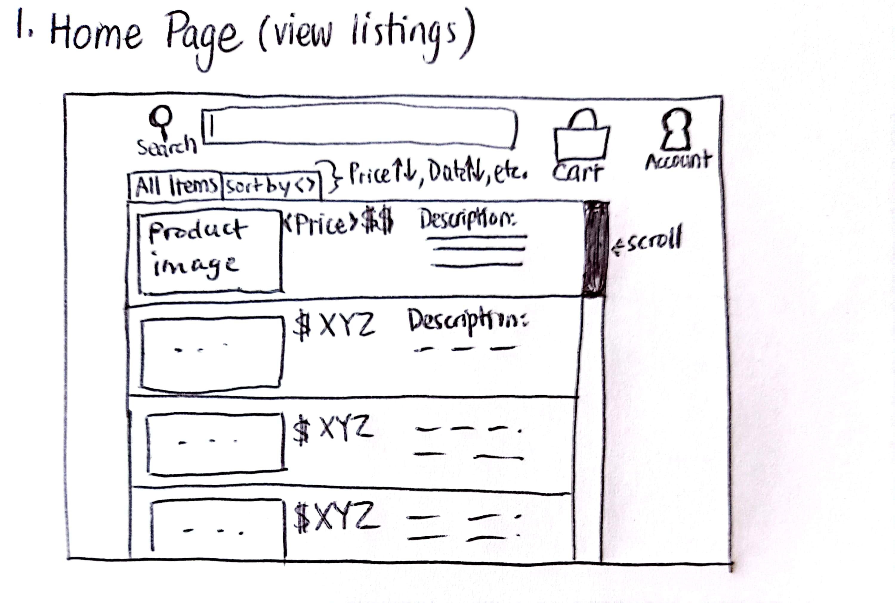
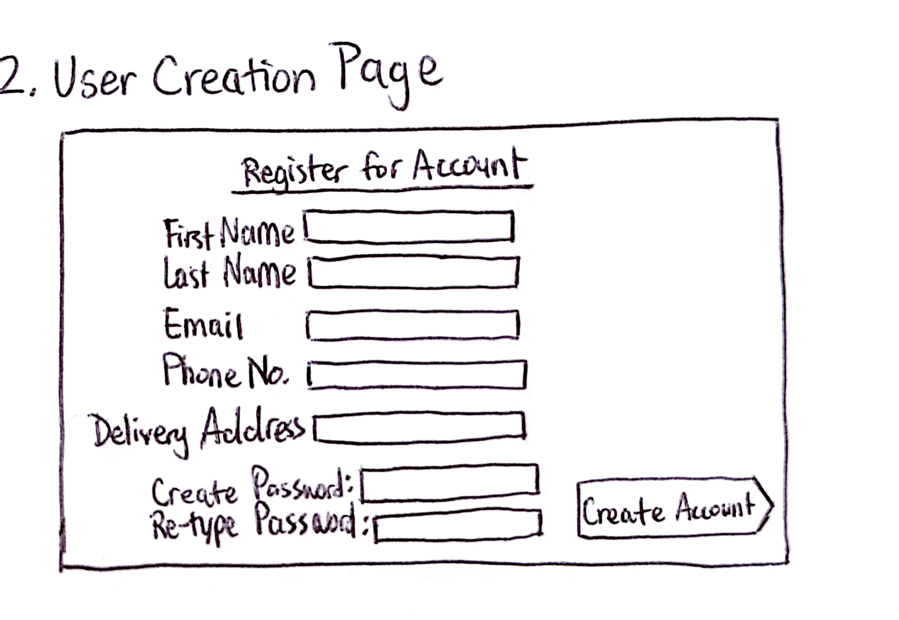
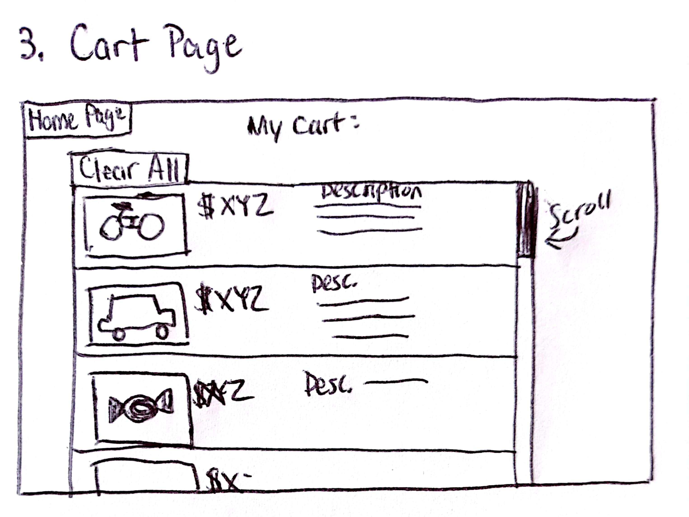

# Group 10 - DealZone
A marketplace website for users wanting to buy and sell items. It will allow users to search, filter, and sort for items to purchase, and sellers to create sales listings. Users may add to cart, purchase, or wishlist sales listings, while sellers can edit or delete listings. Sellers can also add tags to the listings and users can filter listings based on the tags.

## Task Requirements

### Minimal
- Allow users to create an account 
- Allow users to login with account to allow creating, or buying sales items. Otherwise, view only
- View list of sales posts (organized by posting date for example)
- Create, edit, delete sales posts.
- Purchase items (simulate payment, empty cart, mark item(s) as sold)

### Standard
- Search for listing based on keyword matching of title/description
- Sorting function in the search results (by price, by similarity, or by date)
- Tagging mechanism for listings, and allow results to be filtered by said tags
- Cart function(put products in a row and can buy them at once)
- Wishlist function
- Purchase history

### Stretch
- allow users to sign up for restock/discount email notifications for specific items.
- Graphs/ visualizations of products sold, profits, etc. Seller performance insights?
- Utilize ai-algorithm for product suggestion based on purchase or search history

## Team Members

- Andy Lee: 4th year BSc student, currently working as a backend developer, hoping to gain some frontend experience.
- Ivena Du: 4th year CS student, interested in web development and video games.
- Sam Sun: 4th year CS student, have few experience about web design
- Shreya Gupta: M.Eng. student in Computer Engineering, recently worked at Powerex as full stack developer.

#### Task Breakdown

- User login
    - Frontend design: form inputs, username, password. Stylize UI, form input validations. Display error if incorrect password, or redirect to homepage if login successful.
    - Database: create table to keep track of sessions (session id, user id, last_activity)
    - Backend: create login API endpoint for frontend to call on form submit, validate/sanitize inputs, salt + hash password, compare with record in DB. If successful, return session/auth token/cookie to be used in subsequent API calls.
    - Backend: create auth function for each API that returns guest page or logged in page depending on session validation

- Account registration
    - Frontend design: form inputs, username, password, email. Stylize UI, form input validations
    - Database: create table to keep track of users with appropriate fields (do not store password in plaintext, salt + hash)
    - Backend: create registration API endpoint for frontend to call on form submit, validate/sanitize inputs, create DB record.
 

## Images (Prototype Sketches for now)

## References

DZ Logo used from: https://www.freepik.com/premium-vector/logo-dz_42660603.htm 

